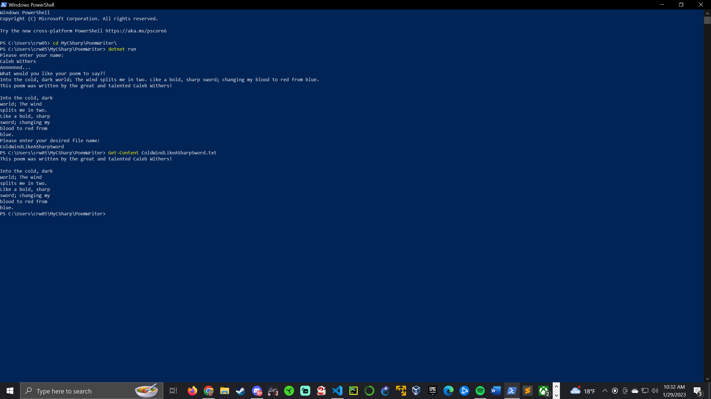

# PoemWriter
This is my very first, super simplistic program that writes a poem that is spaced at 20 characters per line into a .txt file.
I will be developing this as I go. I am trying to get ahead in my C# programming class and using a lot of research to help build this.
This is all a beginner learning experience for me but I can catch on pretty fast.
I hope this is something fun for others as well!

Below is a rough sketch of how to run this program in the PowerShell console and diplay your poem to the console. 

You create a new file in VS Code through the PowerShell console towards the bottom with:
=> dotnet new console -o DesiredFileName --use-program-main true
Then copy and paste the Main.cs code to your own Program.cs file that you create.
to run it 'change directory (cd)' into your program's directory and to run type:
=> dotnet run 
Play around and see what you could add to it, if there's something good it might land on the repo!
This is solely just for fun and I felt like it would be a good learning experience. 
